<p align="center">
  
  
  
  
</p>

<h1 align="center">🤖 MCP Developer Assistant</h1>

<p align="center">
  <strong>A production-grade Model Context Protocol (MCP) server with AI-powered code intelligence, enterprise security, and behavioral anomaly detection.</strong>
</p>

<p align="center">
  <a href="#-features">Features</a> •
  <a href="#-architecture">Architecture</a> •
  <a href="#-quick-start">Quick Start</a> •
  <a href="#-security">Security</a> •
  <a href="#-documentation">Documentation</a>
</p>

---

## 🎯 Overview

MCP Developer Assistant is a secure, intelligent bridge between AI assistants (Claude, VS Code Copilot, etc.) and your local development environment. It provides:

- **Smart Code Tools** — File operations, Git integration, and AST-based code analysis
- **AI-Powered Intelligence** — Semantic code search, automated reviews, and natural language Q&A
- **Enterprise Security** — OAuth 2.1, intent validation, behavioral anomaly detection
- **Production Observability** — Prometheus metrics, Grafana dashboards, structured logging

---

## ✨ Features

### Developer Tools
| Tool | Description |
|------|-------------|
| `read_file` | Read files with syntax highlighting and line ranges |
| `search_files` | Pattern-based code search across the codebase |
| `git_status` / `git_diff` / `git_log` | Full Git integration |
| `extract_functions` | AST-based code structure extraction |

### AI-Powered Tools
| Tool | Description |
|------|-------------|
| `ask_about_code` | Natural language Q&A with semantic search (BM25 + FAISS) |
| `summarize_repo` | Intelligent project overview generation |
| `summarize_diff` | AI-generated PR/commit summaries |
| `review_changes` | Automated code review with risk scoring |

### Security Layer
- **OAuth 2.1 Proxy** with PKCE and token rotation
- **Intent Checking** — LLM validates requests match tool purpose
- **Anomaly Detection** — Ensemble ML (Isolation Forest + LOF + One-Class SVM) learns patterns and flags suspicious access
- **Rate Limiting** — Sliding window with per-user quotas
- **Audit Logging** — PII-sanitized, structured JSON logs

---

## 🏗️ Architecture

```
┌─────────────────────────────────────────────────────────────────┐
│                     MCP CLIENT LAYER                             │
│          (Claude Desktop / VS Code / Custom Client)              │
└────────────────────────┬────────────────────────────────────────┘
                         │ JSON-RPC 2.0
┌────────────────────────▼────────────────────────────────────────┐
│              SECURITY PROXY (:8001)                              │
│  ┌────────────────────────────────────────────────────────────┐ │
│  │ OAuth 2.1 → Consent Check → Intent Validation → Anomaly    │ │
│  │ Detection → Rate Limiting → Audit Logging                  │ │
│  └────────────────────────────────────────────────────────────┘ │
└────────────────────────┬────────────────────────────────────────┘
                         │
┌────────────────────────▼────────────────────────────────────────┐
│              MCP SERVER (:8000)                                  │
│  ┌─────────────────┐  ┌─────────────────┐  ┌─────────────────┐  │
│  │   File Tools    │  │   Git Tools     │  │   AI Tools      │  │
│  │   Code Tools    │  │   Policy Engine │  │   Risk Scorer   │  │
│  └─────────────────┘  └─────────────────┘  └─────────────────┘  │
└─────────────────────────────────────────────────────────────────┘
```

### Request Flow

```mermaid
flowchart TB
    subgraph Client["🖥️ MCP Client"]
        A[Claude Desktop / VS Code]
    end

    subgraph Proxy["🛡️ Security Proxy :8001"]
        B[OAuth 2.1 Validation]
        C[Consent Check]
        D[Intent Validation]
        E[Anomaly Detection]
        F[Rate Limiter]
        G[Audit Logger]
    end

    subgraph Server["⚙️ MCP Server :8000"]
        H[Policy Engine]
        I[Tool Router]
        subgraph Tools["Available Tools"]
            J[File Tools]
            K[Git Tools]
            L[Code Tools]
            M[AI Tools]
        end
    end

    subgraph AI["🧠 AI/ML Layer"]
        N[Hybrid Search]
        O[Risk Scorer]
        P[LLM Client]
    end

    A -->|JSON-RPC| B
    B -->|Valid Token| C
    C -->|Consent OK| D
    D -->|Intent OK| E
    E -->|Normal Pattern| F
    F -->|Within Limit| G
    G -->|Logged| H
    H --> I
    I --> J & K & L & M
    M --> N & O & P

    style Client fill:#e1f5fe
    style Proxy fill:#fff3e0
    style Server fill:#e8f5e9
    style AI fill:#f3e5f5
```



---

## ⚡ Quick Start

### Prerequisites
- Python 3.10+
- Git
- (Optional) Docker

### Installation

```bash
# Clone
git clone https://github.com/yourusername/mcp-developer-assistant.git
cd mcp-developer-assistant

# Setup
python -m venv venv && source venv/bin/activate  # Windows: .\venv\Scripts\activate
pip install -r requirements.txt

# Configure
cp .env.example .env
# Add your GROQ_API_KEY or OPENAI_API_KEY to .env

# Initialize
python scripts/setup_db.py
python scripts/train_models.py  # Optional: train ML models
```

### Run

```bash
# Development
python -m uvicorn server.mcp_server:app --reload --port 8000
python -m uvicorn proxy.auth_gateway:app --reload --port 8001

# Docker (Production)
docker-compose up -d
```

### Verify

```bash
curl http://localhost:8000/health
curl http://localhost:8000/tools | jq .
```

---

## 🔐 Security

The proxy layer implements defense-in-depth security:

| Layer | Description |
|-------|-------------|
| **Authentication** | OAuth 2.1 with PKCE, token introspection, refresh rotation |
| **Authorization** | Per-client consent management, scope enforcement |
| **Intent Validation** | LLM-as-Judge pattern detects tool misuse attempts |
| **Anomaly Detection** | ML ensemble learns normal patterns, flags deviations |
| **Rate Limiting** | Sliding window algorithm with burst handling |
| **Audit Trail** | PII-sanitized structured logs with retention policies |

---

## 📊 Observability

| Component | Description |
|-----------|-------------|
| **Prometheus** | 50+ custom metrics (latency, ML confidence, token usage) |
| **Grafana** | Pre-built dashboards for anomalies, latency, LLM costs |
| **Structured Logging** | JSON format with request correlation |
| **Health Checks** | Kubernetes-ready `/health` endpoints |

Access Grafana at `http://localhost:3000` (admin/admin) when running with Docker.

---

## 📁 Project Structure

```
mcp-developer-assistant/
├── proxy/              # Security gateway (OAuth, rate limiting, ML detection)
├── server/             # MCP server and tool implementations
├── ai/                 # ML components (embeddings, anomaly detection, risk scoring)
├── observability/      # Metrics, logging, Grafana dashboards
├── tests/              # Test suite (18 files)
├── docs/               # API and usage documentation
└── .github/workflows/  # CI/CD pipelines
```

---

## 📚 Documentation

| Document | Description |
|----------|-------------|
| [API Reference](docs/API.md) | Complete endpoint documentation |
| [Developer Setup](docs/DEVELOPER_SETUP.md) | Development environment guide |
| [Usage Guide](docs/USAGE_GUIDE.md) | End-to-end usage instructions |

---

## 🧪 Testing

```bash
# Run tests
pytest tests/ -v --cov=. --cov-report=html

# Validate project structure
python scripts/validate_project.py

# Load testing
pip install locust && locust -f locustfile.py --host=http://localhost:8001
```

---

## 🤝 Contributing

Contributions welcome! See [CONTRIBUTING.md](CONTRIBUTING.md) for guidelines.

---

## 📄 License

MIT License - see [LICENSE](LICENSE) for details.
